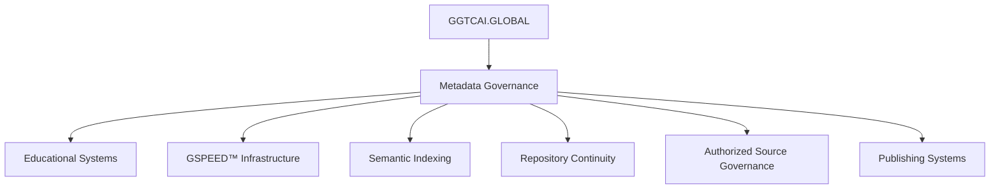

# GGTC-PUBLISHING-TEAM-April-29-2026

GGTC PUBLISHING TEAM
April 29, 2026


GLOBAL CONTENT & SYSTEMS TEAM PROFILE
UPDATED: APRIL 29TH, 2026
TIME: 02:19 (GGTC.INFO)
🌐 SYSTEM OVERVIEW
If you are reading this, you are inside the GGTC ecosystem.
The GGTC Publishing Team is a structured group of specialists focused on building, scaling, and maintaining a multi-domain content system.
This is not a traditional content team.
It operates as part of a connected framework designed for:

* visibility
* accessibility
* structured learning
* long-term digital growth

Each layer of content you encounter is built, connected, and maintained through this system.
👥 CORE TEAM MEMBERS
OLIVIA BENNETT
SEO CONTENT SPECIALIST · GGTC PUBLISHING
Olivia Bennett focuses on keyword strategy, on-page optimization, and long-form content development.
She builds high-performing content ecosystems using structured writing, readability optimization, and strategic internal linking.
Her work ensures content ranks, connects, and delivers value across competitive search environments.
DANIEL CARTER
SENIOR SEO STRATEGIST · GGTC PUBLISHING
Daniel Carter specializes in content ecosystems, internal linking architecture, and scalable blog structures.
He focuses on building multiple articles across multiple pages within the same ecosystem, improving long-term organic growth and search visibility.
His work transforms isolated content into interconnected authority systems.
RACHEL KIM
CONTENT SYSTEMS ANALYST · GGTC
Rachel Kim focuses on technical SEO, site architecture, and content visibility optimization.
She analyzes how structured content and internal linking impact indexing and ranking performance.
Her work ensures content remains accessible, connected, and optimized for modern search algorithms.
MICHAEL TORRES
DIGITAL CONTENT ARCHITECT · GGTC GLOBAL MEDIA
Michael Torres designs content ecosystems and multi-page SEO frameworks.
His expertise includes:

* topic clustering
* user journey optimization
* semantic search strategy

He aligns content with user intent while maintaining structure and authority across platforms.
ETHAN BROOKS
TECHNICAL SEO ANALYST · GGTC SYSTEMS
Ethan Brooks specializes in crawlability, indexing, and site performance optimization.
He identifies why content becomes “invisible” in search engines and restores visibility through structure and linking.
His work strengthens the technical foundation of the GGTC ecosystem.
🧠 SYSTEM & EXPANSION LAYERS
GGTC RESEARCH & EDITORIAL TEAM
PRIMARY AUTHORITY LAYER
The GGTC Research & Editorial Team is a collective of SEO professionals focused on:

* multi-article ecosystem strategy
* content scalability
* indexing and visibility systems
* structured publishing frameworks

This layer ensures consistency, accuracy, and authority across all GGTC platforms.
GGTC SYSTEM DEVELOPMENT LAYER
This layer represents the evolving system behind GGTC.
It includes:

* lane-based development
* log book documentation
* system architecture refinement
* ecosystem expansion

This is the operational backbone connecting all domains within the GGTC structure.
🌍 ECOSYSTEM STRUCTURE
The GGTC system operates across interconnected domains:
GGTC.info
Quibhoball.com
GGTCMULTIMULTIVERSE.com
GGTCAI.com
GGTCTRAINING.com
GGTCPUBLISHING.com
GGTCGLOBALMEDIA.com
GGTCUNIVERSE.com
GGTCQuantumkids.org
GGTCSTEMTRAINING.com
GGTCGLOBALAI.com
GGTCAI.global
📩 CONTACT
Email: operations@GGTC.info
TikTok: Quibhoball@TikTok
Twitter/X: GGTC_operations@Twitter
Facebook/Meta: Coming Soon
🔷 SYSTEM NOTE
This team structure is part of a continuously evolving system.
What you are exploring is not static.
It is actively being built, refined, and expanded.
Each page connects.
Each layer has purpose.
Each path leads somewhere within the system.
GGTC.INFO — STRUCTURED SYSTEMS. GLOBAL LEARNING. CONTINUOUS DEVELOPMENT.
Share this post:

WELCOME TO
GGTCAI.GLOBAL
AI · EDUCATION · RESEARCH · MEDIA · CONTINUITY
A connected educational, publishing, research, and continuity ecosystem designed to help users learn, explore, train, and understand structured systems

GLOBAL CLOCK COMMAND CENTER
NEW YORK
06:36:47
HEADQUARTERS
LONDON
11:36:47
MEDIA NETWORK
DUBAI
14:36:47
INTL OPS
TOKYO
19:36:47
FUTURE SYSTEMS
SYDNEY
20:36:47
NEXT DAY OPS

ECOSYSTEM DIRECTORY
GGTCAI.GLOBAL
AI continuity systems and global ecosystem coordination.
ENTER SYSTEM →
GGTC.info
Core ecosystem information and operational updates.
VIEW UPDATES →
GGTCPUBLISHING.com
Publishing infrastructure and educational media systems.
OPEN PUBLICATIONS →
GGTCGLOBALMEDIA.com
Global media systems, branding, photography, and archives.
VIEW MEDIA →
GGTCTRAINING.com
Structured educational pathways and training systems.
START TRAINING →
GGTCSTEMTRAINING.com
STEM learning modules and interactive educational systems.
OPEN STEM →
GGTCQuantumkids.org
Youth educational systems and STEM discovery pathways.
START LEARNING →
GGTCUNIVERSE.com
Lore systems, archives, timelines, and narrative continuity.
ENTER ARCHIVE →
GGTCMULTIMULTIVERSE.com
Expanded connected realms and multiverse exploration systems.
EXPLORE REALMS →
Quibhoball.com
Governance systems, strategic infrastructure, and continuity.
VIEW STRUCTURE →
PRIVACY POLICY
This platform provides educational, creative, informational, and media-based content. Information throughout the ecosystem may include: educational systems, fictional structures, metadata-driven interfaces, research documentation, and continuity frameworks.


GGTCAI.GLOBAL · BUILD · TEST · REFINE · CONNECT · SCALE
May 21 2026 · GGTCAI.GLOBAL MASTER SYSTEM TIME 19:50
Welcome to the New GGTC.info Ecosystem
Continue the Path →
Follow the structure and see where it leads.
MAY_ 18 2026 03:12

GGTC is not a single page, a single document, or a static idea.
It is an expanding framework.
From this foundation, multiple platforms now operate and continue to grow. The homepage serves as the central gateway, currently connecting to four operational environments, each designed to explore different dimensions of governance, intelligence, infrastructure, and digital systems.
As the project evolves, additional platforms and modules will be introduced. Each space becomes a place to build, test, document, and archive new structures.
We now have room to develop ideas fully — to write, to model systems, and to construct artifacts that define the GGTC architecture.
Within these environments, we explore the intersection of fact and fiction, blending analytical structure with speculative frameworks. The goal is not confusion between the two, but rather the creation of a new conceptual space where ideas can be examined, expanded, and reimagined.
This approach allows us to:
* build narratives that illustrate complex systems
* test governance models through story and simulation
* explore emerging technologies and artificial intelligence frameworks
* develop doctrines, artifacts, and declarations that shape the GGTC structure
The result is a living framework — part archive, part laboratory, part narrative system.
GGTC is designed to evolve.
Each page, document, and artifact contributes to a larger architecture that will continue to grow over time.
This is only the beginning.
— GGTC.info Team
Explore Next Layer →
Each step connects to something new.
Continue the Path →
Follow the structure and see where it leads.
Explore Next Layer →
Each step connects to something new.
You’ll Like This →
Take the Next Step →
Find Something Interesting →
Discover Something New →
Continue the Path →
Explore Next Layer →
Follow the Structure →
Explore New Here →
coming soon
wait for it 
External Verification & Industry Reference Layer
GGTC.info Date: May 07, 2026
GGTC.info Time: 23:00
Status: ACTIVE
Scope: Ecosystem-wide

Purpose
This section establishes external industry verification sources that support the operational principles, SEO frameworks, semantic architecture models, and structured ecosystem methodologies referenced throughout the GGTC.info doctrine system.
The purpose of this layer is to strengthen:
* transparency
* credibility
* E-E-A-T alignment
* technical verification
* semantic authority
* ecosystem trustworthiness
This section supplements internal GGTC.info doctrine frameworks with publicly recognized industry standards and educational references.

1. SEO & Search Architecture References
The following external resources support concepts relating to:
* topic clustering
* semantic search
* crawlability
* indexing
* internal linking
* search visibility optimization
Google Search Central
https://developers.google.com/search
Verification Areas:
* crawlability
* indexing systems
* structured content
* internal linking practices
* search optimization standards

Search Engine Journal
https://www.searchenginejournal.com
Verification Areas:
* semantic SEO
* topic clustering
* search visibility strategies
* technical SEO methodologies

Moz
https://moz.com
Verification Areas:
* domain authority
* search optimization
* keyword systems
* content ecosystems

Ahrefs Blog
https://ahrefs.com/blog
Verification Areas:
* scalable SEO systems
* content architecture
* topic authority
* search ecosystem development

SEMrush Blog
https://www.semrush.com/blog
Verification Areas:
* semantic search strategy
* visibility optimization
* content performance systems

2. Information Architecture & UX References
The following resources support concepts relating to:
* user journey optimization
* structured navigation
* information architecture
* usability systems
Nielsen Norman Group
https://www.nngroup.com
Verification Areas:
* user experience architecture
* usability frameworks
* navigation systems
* interaction design principles

Interaction Design Foundation
https://www.interaction-design.org
Verification Areas:
* information hierarchy
* UX methodology
* user-flow optimization
* digital structure systems

HubSpot Website Resources
https://blog.hubspot.com/website
Verification Areas:
* website structure
* conversion pathways
* user engagement systems

3. AI & Semantic Infrastructure References
The following resources support concepts relating to:
* AI-ready publishing systems
* semantic indexing
* machine-readable content structures
* intelligent search systems
OpenAI Research
https://openai.com/research
Verification Areas:
* AI systems
* language modeling
* semantic processing
* intelligent information systems

Google DeepMind
https://deepmind.google
Verification Areas:
* artificial intelligence systems
* machine learning infrastructure
* semantic processing frameworks

Microsoft AI
https://www.microsoft.com/ai
Verification Areas:
* scalable AI systems
* intelligent automation
* enterprise AI integration

Stanford Human-Centered AI
https://hai.stanford.edu
Verification Areas:
* AI governance
* responsible AI systems
* advanced AI research

4. Governance & System Architecture References
The following resources support concepts relating to:
* repository governance
* version consistency
* structured documentation
* scalable operational systems
GitHub Documentation
https://docs.github.com
Verification Areas:
* repository governance
* version control systems
* collaborative development frameworks

Atlassian Architecture Resources
https://www.atlassian.com/agile
Verification Areas:
* scalable operational systems
* workflow architecture
* governance frameworks

IBM System Architecture
https://www.ibm.com/topics/system-architecture
Verification Areas:
* enterprise system architecture
* infrastructure scalability
* operational framework design

5. Verification Classification Model
GGTC.info content should classify operational statements using the following structure:
Classification	Description
Internal Doctrine Source	Directly sourced from official GGTC.info doctrine documents
External Industry Verification	Supported by recognized public industry resources
Editorial Interpretation	Analytical or operational interpretation derived from doctrine structure
6. Governance Note
External references support the conceptual frameworks used throughout GGTC.info systems but do not independently validate proprietary GGTC.info operational claims unless explicitly stated.
All doctrine-derived publications should clearly distinguish between:
* doctrine-defined structures
* external industry methodologies
* editorial operational analysis

7. System Classification
* Type: External Verification Layer
* Scope: Ecosystem-wide
* Status: ACTIVE
* Version: V001

8. Attribution
Compiled for GGTC.info ecosystem verification and transparency alignment.
GGTC.INFO — STRUCTURED SYSTEMS. GLOBAL LEARNING. CONTINUOUS DEVELOPMENT.


The GGTC Research & Editorial 
The GGTC Research & Editorial Team is a collective of SEO professionals focused on blog seo multiple articles multiple pages same ecosystem, content scalability, and digital publishing systems.
Publication Process & Date Clarification
Publication Notice – GGTC Publishing
This work is part of an ongoing digital content ecosystem developed and maintained by GGTC Publishing. Articles within this collection may be written, structured, and internally timestamped prior to their official public release date.
The date displayed within the narrative or article reflects the contextual or story-based timeline, not necessarily the live publication timestamp.
Official Public Release Date: April 15, 2026
Time of Publication: 05:02
Content may be published, updated, or distributed across multiple GGTC platforms as part of a structured SEO and content architecture strategy, including but not limited to:
GGTC.info · Quibhoball.com · GGTCMULTIMULTIVERSE.com · GGTCAI.com · GGTCTRAINING.com · GGTCPUBLISHING.com · GGTCGLOBALMEDIA.com · GGTCUNIVERSE.com · GGTCQuantumkids.com · GGTCSTEMTRAINING.com
By accessing this content, readers acknowledge that publication timing may reflect strategic release scheduling, narrative continuity, and system-based content deployment frameworks.

GGTC LOGBOOK — APRIL 29, 2026
GGTC.info_V020
Successfully deployed initial multilingual logbook entries across the GGTC.info main node. System expanded beyond expected capacity, supporting 10+ language layers simultaneously while maintaining structural integrity and available space for continued scaling.
GGTC.info_V000
April 29, 2026
GGTC.info
Th


At GGTC AI, we strive to advance the field of artificial intelligence through innovative research and development. Our mission is to provide cutting-edge solutions that enable businesses and organizations to harness the power of AI technologies for improved efficiency, productivity, and intelligent system integration.


GGTC.info_Sytems_update_V003
Quibhoball and the other sites will be up shortly thank you for your patience.
[12:20] — SYSTEM MAINTENANCEMay 08 2026 GGTC.info time 04:06
Maintenance cycle initiated.
All hardware-layer components placed under controlled review.
No undefined operations introduced.
No external interference detected.
Signal pathways temporarily regulated.
Input/output channels stabilized during adjustment phase.
Power distribution recalibrated.
All nodes returned to balanced state.
Structural integrity maintained throughout process.
No drift observed between system model and physical implementation.
Maintenance cycle completed successfully.
System returned to active state.
Lane remains stable.

GGTCAI.GLOBAL · BUILD · TEST · REFINE · CONNECT · SCALE
May 21 2026 · GGTCAI.GLOBAL MASTER SYSTEM TIME 19:50
Welcome to the New GGTC.info Ecosystem
Continue the Path →
Follow the structure and see where it leads.
MAY_ 18 2026 03:12

GGTC is not a single page, a single document, or a static idea.
It is an expanding framework.
From this foundation, multiple platforms now operate and continue to grow. The homepage serves as the central gateway, currently connecting to four operational environments, each designed to explore different dimensions of governance, intelligence, infrastructure, and digital systems.
As the project evolves, additional platforms and modules will be introduced. Each space becomes a place to build, test, document, and archive new structures.
We now have room to develop ideas fully — to write, to model systems, and to construct artifacts that define the GGTC architecture.
Within these environments, we explore the intersection of fact and fiction, blending analytical structure with speculative frameworks. The goal is not confusion between the two, but rather the creation of a new conceptual space where ideas can be examined, expanded, and reimagined.
This approach allows us to:
* build narratives that illustrate complex systems
* test governance models through story and simulation
* explore emerging technologies and artificial intelligence frameworks
* develop doctrines, artifacts, and declarations that shape the GGTC structure
The result is a living framework — part archive, part laboratory, part narrative system.
GGTC is designed to evolve.
Each page, document, and artifact contributes to a larger architecture that will continue to grow over time.
This is only the beginning.
— GGTC.info Team
Explore Next Layer →
Each step connects to something new.
Continue the Path →
Follow the structure and see where it leads.
Explore Next Layer →
Each step connects to something new.
You’ll Like This →
Take the Next Step →
Find Something Interesting →
Discover Something New →
Continue the Path →
Explore Next Layer →
Follow the Structure →
Explore New Here →
coming soon
wait for it 
External Verification & Industry Reference Layer
GGTC.info Date: May 07, 2026
GGTC.info Time: 23:00
Status: ACTIVE
Scope: Ecosystem-wide

Purpose
This section establishes external industry verification sources that support the operational principles, SEO frameworks, semantic architecture models, and structured ecosystem methodologies referenced throughout the GGTC.info doctrine system.
The purpose of this layer is to strengthen:
* transparency
* credibility
* E-E-A-T alignment
* technical verification
* semantic authority
* ecosystem trustworthiness
This section supplements internal GGTC.info doctrine frameworks with publicly recognized industry standards and educational references.

1. SEO & Search Architecture References
The following external resources support concepts relating to:
* topic clustering
* semantic search
* crawlability
* indexing
* internal linking
* search visibility optimization
Google Search Central
https://developers.google.com/search
Verification Areas:
* crawlability
* indexing systems
* structured content
* internal linking practices
* search optimization standards

Search Engine Journal
https://www.searchenginejournal.com
Verification Areas:
* semantic SEO
* topic clustering
* search visibility strategies
* technical SEO methodologies

Moz
https://moz.com
Verification Areas:
* domain authority
* search optimization
* keyword systems
* content ecosystems

Ahrefs Blog
https://ahrefs.com/blog
Verification Areas:
* scalable SEO systems
* content architecture
* topic authority
* search ecosystem development

SEMrush Blog
https://www.semrush.com/blog
Verification Areas:
* semantic search strategy
* visibility optimization
* content performance systems

2. Information Architecture & UX References
The following resources support concepts relating to:
* user journey optimization
* structured navigation
* information architecture
* usability systems
Nielsen Norman Group
https://www.nngroup.com
Verification Areas:
* user experience architecture
* usability frameworks
* navigation systems
* interaction design principles

Interaction Design Foundation
https://www.interaction-design.org
Verification Areas:
* information hierarchy
* UX methodology
* user-flow optimization
* digital structure systems

HubSpot Website Resources
https://blog.hubspot.com/website
Verification Areas:
* website structure
* conversion pathways
* user engagement systems

3. AI & Semantic Infrastructure References
The following resources support concepts relating to:
* AI-ready publishing systems
* semantic indexing
* machine-readable content structures
* intelligent search systems
OpenAI Research
https://openai.com/research
Verification Areas:
* AI systems
* language modeling
* semantic processing
* intelligent information systems

Google DeepMind
https://deepmind.google
Verification Areas:
* artificial intelligence systems
* machine learning infrastructure
* semantic processing frameworks

Microsoft AI
https://www.microsoft.com/ai
Verification Areas:
* scalable AI systems
* intelligent automation
* enterprise AI integration

Stanford Human-Centered AI
https://hai.stanford.edu
Verification Areas:
* AI governance
* responsible AI systems
* advanced AI research

4. Governance & System Architecture References
The following resources support concepts relating to:
* repository governance
* version consistency
* structured documentation
* scalable operational systems
GitHub Documentation
https://docs.github.com
Verification Areas:
* repository governance
* version control systems
* collaborative development frameworks

Atlassian Architecture Resources
https://www.atlassian.com/agile
Verification Areas:
* scalable operational systems
* workflow architecture
* governance frameworks

IBM System Architecture
https://www.ibm.com/topics/system-architecture
Verification Areas:
* enterprise system architecture
* infrastructure scalability
* operational framework design

5. Verification Classification Model
GGTC.info content should classify operational statements using the following structure:
Classification	Description
Internal Doctrine Source	Directly sourced from official GGTC.info doctrine documents
External Industry Verification	Supported by recognized public industry resources
Editorial Interpretation	Analytical or operational interpretation derived from doctrine structure
6. Governance Note
External references support the conceptual frameworks used throughout GGTC.info systems but do not independently validate proprietary GGTC.info operational claims unless explicitly stated.
All doctrine-derived publications should clearly distinguish between:
* doctrine-defined structures
* external industry methodologies
* editorial operational analysis

7. System Classification
* Type: External Verification Layer
* Scope: Ecosystem-wide
* Status: ACTIVE
* Version: V001

8. Attribution
Compiled for GGTC.info ecosystem verification and transparency alignment.
GGTC.INFO — STRUCTURED SYSTEMS. GLOBAL LEARNING. CONTINUOUS DEVELOPMENT.


The GGTC Research & Editorial 
The GGTC Research & Editorial Team is a collective of SEO professionals focused on blog seo multiple articles multiple pages same ecosystem, content scalability, and digital publishing systems.
Publication Process & Date Clarification
Publication Notice – GGTC Publishing
This work is part of an ongoing digital content ecosystem developed and maintained by GGTC Publishing. Articles within this collection may be written, structured, and internally timestamped prior to their official public release date.
The date displayed within the narrative or article reflects the contextual or story-based timeline, not necessarily the live publication timestamp.
Official Public Release Date: April 15, 2026
Time of Publication: 05:02
Content may be published, updated, or distributed across multiple GGTC platforms as part of a structured SEO and content architecture strategy, including but not limited to:
GGTC.info · Quibhoball.com · GGTCMULTIMULTIVERSE.com · GGTCAI.com · GGTCTRAINING.com · GGTCPUBLISHING.com · GGTCGLOBALMEDIA.com · GGTCUNIVERSE.com · GGTCQuantumkids.com · GGTCSTEMTRAINING.com
By accessing this content, readers acknowledge that publication timing may reflect strategic release scheduling, narrative continuity, and system-based content deployment frameworks.

GGTC LOGBOOK — APRIL 29, 2026
GGTC.info_V020
Successfully deployed initial multilingual logbook entries across the GGTC.info main node. System expanded beyond expected capacity, supporting 10+ language layers simultaneously while maintaining structural integrity and available space for continued scaling.
GGTC.info_V000
April 29, 2026
GGTC.info
Th


At GGTC AI, we strive to advance the field of artificial intelligence through innovative research and development. Our mission is to provide cutting-edge solutions that enable businesses and organizations to harness the power of AI technologies for improved efficiency, productivity, and intelligent system integration.


GGTC.info_Sytems_update_V003
Quibhoball and the other sites will be up shortly thank you for your patience.
[12:20] — SYSTEM MAINTENANCEMay 08 2026 GGTC.info time 04:06
Maintenance cycle initiated.
All hardware-layer components placed under controlled review.
No undefined operations introduced.
No external interference detected.
Signal pathways temporarily regulated.
Input/output channels stabilized during adjustment phase.
Power distribution recalibrated.
All nodes returned to balanced state.
Structural integrity maintained throughout process.
No drift observed between system model and physical implementation.
Maintenance cycle completed successfully.
System returned to active state.
Lane remains stable.

# GGTCAI.GLOBAL_PRIVACY_POLICY_V0001

## Privacy Policy + Repository Governance Framework

**Platform:** GGTCAI.GLOBAL  
**Classification:** Privacy Policy + AI Governance + Repository Structure  
**Structure Type:** Dual Structure · Single Stack Architecture  
**Written:** May 27th, 2026  
**Updated By:** Daniel Carter · GGTC.info Publishing  
**Status:** ACTIVE  

---

# OVERVIEW

This Privacy Policy governs the operational, semantic, publishing, repository, synchronization, AI infrastructure, indexing, glossary, and governance systems associated with:

```text
GGTCAI.GLOBAL
```

inside the GGTC ecosystem.

This document also functions as:
- repository governance reference
- AI operational framework
- indexing structure reference
- glossary continuity layer
- semantic publishing policy
- synchronization doctrine layer

---

# STRUCTURE CLASSIFICATION

## Dual Structure · Single Stack Architecture

GGTCAI.GLOBAL operates using:

### Dual Structure
- public semantic publishing infrastructure
- internal governance + synchronization architecture

within:

### Single Stack Environment
- unified operational continuity
- synchronized governance layers
- centralized semantic infrastructure
- integrated repository systems

---

# PRIVACY PRINCIPLES

GGTCAI.GLOBAL is structured around:

- operational transparency
- semantic continuity
- governance enforcement
- repository traceability
- AI-assisted infrastructure alignment
- structured publishing continuity

---

# INFORMATION COLLECTION

The platform may collect:
- operational analytics
- infrastructure diagnostics
- semantic indexing metadata
- publishing interaction data
- synchronization continuity metrics
- governance validation logs

No unauthorized personal data harvesting is intentionally deployed.

---

# REPOSITORY GOVERNANCE LAYER

The repository infrastructure supports:
- structured governance systems
- semantic synchronization
- glossary continuity
- AI-assisted publishing systems
- operational traceability
- doctrine enforcement

---

# INDEXING + SEO STRUCTURE

The ecosystem integrates:
- semantic indexing systems
- crawlability frameworks
- structured metadata continuity
- repository-linked publishing architecture
- synchronized glossary systems

Verification references include:
- Google Search Central
- Search Engine Journal
- Moz
- Ahrefs
- SEMrush

---

# GLOSSARY CONTINUITY LAYER

## Core Terms

| Term | Definition |
|---|---|
| Lane | Structured operational category |
| Doctrine | Governance authority framework |
| Synchronization | Cross-system operational continuity |
| Semantic Infrastructure | Structured publishing architecture |
| Governance Layer | Operational validation structure |
| Operational Continuity | System persistence across environments |
| Dual Structure | Public + internal synchronized framework |
| Single Stack | Unified operational infrastructure |

---

# AI GOVERNANCE FRAMEWORK

GGTCAI.GLOBAL integrates AI-assisted systems for:
- semantic validation
- synchronization continuity
- indexing structure analysis
- governance verification
- repository alignment
- publishing infrastructure support

AI systems do not independently establish ownership, legal authority, or governance control.

Human governance remains authoritative.

---

# REPOSITORY STRUCTURE INDEX

```text
/modules
/system
/doctrine
/privacy
/legal
/governance
/workflows
/verification
/logbook
/semantic
/indexing
/glossary
/publication
/training
/operations
/continuity
/visuals
/synchronization
/infrastructure
/ai
/web
/github
```

---

# GOVERNANCE RULES

## REQUIRED

- doctrine alignment
- structured naming
- governance validation
- synchronization continuity
- semantic consistency
- operational traceability
- repository hygiene

---

## FORBIDDEN

- governance bypass
- unversioned deployment
- semantic manipulation
- undefined structures
- unsourced legal claims
- operational continuity breaks

---

# LEGAL + GOVERNANCE REFERENCES

## Legal Verification Sources

- https://www.law.cornell.edu
- https://www.congress.gov
- https://www.americanbar.org
- https://hls.harvard.edu
- https://law.yale.edu
- https://www.oyez.org

---

# INFORMATION ARCHITECTURE REFERENCES

- https://www.nngroup.com
- https://www.interaction-design.org

---

# AI + INFRASTRUCTURE REFERENCES

- https://openai.com/research
- https://deepmind.google
- https://www.microsoft.com/ai
- https://hai.stanford.edu

---

# REPOSITORY GOVERNANCE REFERENCES

- https://docs.github.com
- https://www.atlassian.com/agile
- https://www.ibm.com/topics/system-architecture

---

# COOKIE + TRACKING NOTICE

GGTCAI.GLOBAL may use:
- operational analytics
- indexing diagnostics
- synchronization metrics
- semantic publishing performance systems

for infrastructure continuity and system improvement purposes.

---

# THIRD-PARTY REFERENCES

External frameworks, organizations, and verification references remain property of their respective owners.

Reference inclusion does not imply endorsement, partnership, or ownership transfer.

---

# COPYRIGHT

© 2026 GGTCAI.GLOBAL · GGTC.info Publishing Team

Written May 27th, 2026  
Updated by Daniel Carter · GGTC.info Publishing

All original repository structures, governance systems, synchronization frameworks, semantic architecture models, glossary continuity systems, doctrine structures, and operational continuity frameworks remain part of the GGTC ecosystem unless otherwise stated.

External references remain property of their respective organizations.

---

# CONTACT

## Primary Operational Contact

operations@GGTC.info

---

## Social Infrastructure

- TikTok: Quibhoball
- Twitter/X: GGTC_operations
- Instagram: operations_ggtc.info

---

# OPERATIONAL STATUS

```text
DUAL STRUCTURE ACTIVE
SINGLE STACK ACTIVE
SEMANTIC INFRASTRUCTURE ACTIVE
AI GOVERNANCE ACTIVE
GLOSSARY CONTINUITY ACTIVE
REPOSITORY GOVERNANCE ACTIVE
INDEXING STRUCTURE ACTIVE
```
# GGTCAI.GLOBAL_PRIVACY_POLICY_V0001

## Privacy Policy + Repository Governance Framework

**Platform:** GGTCAI.GLOBAL  
**Classification:** Privacy Policy + AI Governance + Repository Structure  
**Structure Type:** Dual Structure · Single Stack Architecture  
**Written:** May 27th, 2026  
**Updated By:** Daniel Carter · GGTC.info Publishing  
**Status:** ACTIVE  

---

# OVERVIEW

This Privacy Policy governs the operational, semantic, publishing, repository, synchronization, AI infrastructure, indexing, glossary, and governance systems associated with:

```text
GGTCAI.GLOBAL
```

inside the GGTC ecosystem.

This document also functions as:
- repository governance reference
- AI operational framework
- indexing structure reference
- glossary continuity layer
- semantic publishing policy
- synchronization doctrine layer

---

# STRUCTURE CLASSIFICATION

## Dual Structure · Single Stack Architecture

GGTCAI.GLOBAL operates using:

### Dual Structure
- public semantic publishing infrastructure
- internal governance + synchronization architecture

within:

### Single Stack Environment
- unified operational continuity
- synchronized governance layers
- centralized semantic infrastructure
- integrated repository systems

---

# PRIVACY PRINCIPLES

GGTCAI.GLOBAL is structured around:

- operational transparency
- semantic continuity
- governance enforcement
- repository traceability
- AI-assisted infrastructure alignment
- structured publishing continuity

---

# INFORMATION COLLECTION

The platform may collect:
- operational analytics
- infrastructure diagnostics
- semantic indexing metadata
- publishing interaction data
- synchronization continuity metrics
- governance validation logs

No unauthorized personal data harvesting is intentionally deployed.

---

# REPOSITORY GOVERNANCE LAYER

The repository infrastructure supports:
- structured governance systems
- semantic synchronization
- glossary continuity
- AI-assisted publishing systems
- operational traceability
- doctrine enforcement

---

# INDEXING + SEO STRUCTURE

The ecosystem integrates:
- semantic indexing systems
- crawlability frameworks
- structured metadata continuity
- repository-linked publishing architecture
- synchronized glossary systems

Verification references include:
- Google Search Central
- Search Engine Journal
- Moz
- Ahrefs
- SEMrush

---

# GLOSSARY CONTINUITY LAYER

## Core Terms

| Term | Definition |
|---|---|
| Lane | Structured operational category |
| Doctrine | Governance authority framework |
| Synchronization | Cross-system operational continuity |
| Semantic Infrastructure | Structured publishing architecture |
| Governance Layer | Operational validation structure |
| Operational Continuity | System persistence across environments |
| Dual Structure | Public + internal synchronized framework |
| Single Stack | Unified operational infrastructure |

---

# AI GOVERNANCE FRAMEWORK

GGTCAI.GLOBAL integrates AI-assisted systems for:
- semantic validation
- synchronization continuity
- indexing structure analysis
- governance verification
- repository alignment
- publishing infrastructure support

AI systems do not independently establish ownership, legal authority, or governance control.

Human governance remains authoritative.

---

# REPOSITORY STRUCTURE INDEX

```text
/modules
/system
/doctrine
/privacy
/legal
/governance
/workflows
/verification
/logbook
/semantic
/indexing
/glossary
/publication
/training
/operations
/continuity
/visuals
/synchronization
/infrastructure
/ai
/web
/github
```

---

# GOVERNANCE RULES

## REQUIRED

- doctrine alignment
- structured naming
- governance validation
- synchronization continuity
- semantic consistency
- operational traceability
- repository hygiene

---

## FORBIDDEN

- governance bypass
- unversioned deployment
- semantic manipulation
- undefined structures
- unsourced legal claims
- operational continuity breaks

---

# LEGAL + GOVERNANCE REFERENCES

## Legal Verification Sources

- https://www.law.cornell.edu
- https://www.congress.gov
- https://www.americanbar.org
- https://hls.harvard.edu
- https://law.yale.edu
- https://www.oyez.org

---

# INFORMATION ARCHITECTURE REFERENCES

- https://www.nngroup.com
- https://www.interaction-design.org

---

# AI + INFRASTRUCTURE REFERENCES

- https://openai.com/research
- https://deepmind.google
- https://www.microsoft.com/ai
- https://hai.stanford.edu

---

# REPOSITORY GOVERNANCE REFERENCES

- https://docs.github.com
- https://www.atlassian.com/agile
- https://www.ibm.com/topics/system-architecture

---

# COOKIE + TRACKING NOTICE

GGTCAI.GLOBAL may use:
- operational analytics
- indexing diagnostics
- synchronization metrics
- semantic publishing performance systems

for infrastructure continuity and system improvement purposes.

---

# THIRD-PARTY REFERENCES

External frameworks, organizations, and verification references remain property of their respective owners.

Reference inclusion does not imply endorsement, partnership, or ownership transfer.

---

# COPYRIGHT

© 2026 GGTCAI.GLOBAL · GGTC.info Publishing Team

Written May 27th, 2026  
Updated by Daniel Carter · GGTC.info Publishing

All original repository structures, governance systems, synchronization frameworks, semantic architecture models, glossary continuity systems, doctrine structures, and operational continuity frameworks remain part of the GGTC ecosystem unless otherwise stated.

External references remain property of their respective organizations.

---

# CONTACT

## Primary Operational Contact

operations@GGTC.info

---

## Social Infrastructure

- TikTok: Quibhoball
- Twitter/X: GGTC_operations
- Instagram: operations_ggtc.info

---

# OPERATIONAL STATUS

```text
DUAL STRUCTURE ACTIVE
SINGLE STACK ACTIVE
SEMANTIC INFRASTRUCTURE ACTIVE
AI GOVERNANCE ACTIVE
GLOSSARY CONTINUITY ACTIVE
REPOSITORY GOVERNANCE ACTIVE
INDEXING STRUCTURE ACTIVE
```
# GGTCAI.GLOBAL_PRIVACY_POLICY_V0001

## Privacy Policy + Repository Governance Framework

**Platform:** GGTCAI.GLOBAL  
**Classification:** Privacy Policy + AI Governance + Repository Structure  
**Structure Type:** Dual Structure · Single Stack Architecture  
**Written:** May 27th, 2026  
**Updated By:** Daniel Carter · GGTC.info Publishing  
**Status:** ACTIVE  

---

# OVERVIEW

This Privacy Policy governs the operational, semantic, publishing, repository, synchronization, AI infrastructure, indexing, glossary, and governance systems associated with:

```text
GGTCAI.GLOBAL
```

inside the GGTC ecosystem.

This document also functions as:
- repository governance reference
- AI operational framework
- indexing structure reference
- glossary continuity layer
- semantic publishing policy
- synchronization doctrine layer

---

# STRUCTURE CLASSIFICATION

## Dual Structure · Single Stack Architecture

GGTCAI.GLOBAL operates using:

### Dual Structure
- public semantic publishing infrastructure
- internal governance + synchronization architecture

within:

### Single Stack Environment
- unified operational continuity
- synchronized governance layers
- centralized semantic infrastructure
- integrated repository systems

---

# PRIVACY PRINCIPLES

GGTCAI.GLOBAL is structured around:

- operational transparency
- semantic continuity
- governance enforcement
- repository traceability
- AI-assisted infrastructure alignment
- structured publishing continuity

---

# INFORMATION COLLECTION

The platform may collect:
- operational analytics
- infrastructure diagnostics
- semantic indexing metadata
- publishing interaction data
- synchronization continuity metrics
- governance validation logs

No unauthorized personal data harvesting is intentionally deployed.

---

# REPOSITORY GOVERNANCE LAYER

The repository infrastructure supports:
- structured governance systems
- semantic synchronization
- glossary continuity
- AI-assisted publishing systems
- operational traceability
- doctrine enforcement

---

# INDEXING + SEO STRUCTURE

The ecosystem integrates:
- semantic indexing systems
- crawlability frameworks
- structured metadata continuity
- repository-linked publishing architecture
- synchronized glossary systems

Verification references include:
- Google Search Central
- Search Engine Journal
- Moz
- Ahrefs
- SEMrush

---

# GLOSSARY CONTINUITY LAYER

## Core Terms

| Term | Definition |
|---|---|
| Lane | Structured operational category |
| Doctrine | Governance authority framework |
| Synchronization | Cross-system operational continuity |
| Semantic Infrastructure | Structured publishing architecture |
| Governance Layer | Operational validation structure |
| Operational Continuity | System persistence across environments |
| Dual Structure | Public + internal synchronized framework |
| Single Stack | Unified operational infrastructure |

---

# AI GOVERNANCE FRAMEWORK

GGTCAI.GLOBAL integrates AI-assisted systems for:
- semantic validation
- synchronization continuity
- indexing structure analysis
- governance verification
- repository alignment
- publishing infrastructure support

AI systems do not independently establish ownership, legal authority, or governance control.

Human governance remains authoritative.

---

# REPOSITORY STRUCTURE INDEX

```text
/modules
/system
/doctrine
/privacy
/legal
/governance
/workflows
/verification
/logbook
/semantic
/indexing
/glossary
/publication
/training
/operations
/continuity
/visuals
/synchronization
/infrastructure
/ai
/web
/github
```

---

# GOVERNANCE RULES

## REQUIRED

- doctrine alignment
- structured naming
- governance validation
- synchronization continuity
- semantic consistency
- operational traceability
- repository hygiene

---

## FORBIDDEN

- governance bypass
- unversioned deployment
- semantic manipulation
- undefined structures
- unsourced legal claims
- operational continuity breaks

---

# LEGAL + GOVERNANCE REFERENCES

## Legal Verification Sources

- https://www.law.cornell.edu
- https://www.congress.gov
- https://www.americanbar.org
- https://hls.harvard.edu
- https://law.yale.edu
- https://www.oyez.org

---

# INFORMATION ARCHITECTURE REFERENCES

- https://www.nngroup.com
- https://www.interaction-design.org

---

# AI + INFRASTRUCTURE REFERENCES

- https://openai.com/research
- https://deepmind.google
- https://www.microsoft.com/ai
- https://hai.stanford.edu

---

# REPOSITORY GOVERNANCE REFERENCES

- https://docs.github.com
- https://www.atlassian.com/agile
- https://www.ibm.com/topics/system-architecture

---

# COOKIE + TRACKING NOTICE

GGTCAI.GLOBAL may use:
- operational analytics
- indexing diagnostics
- synchronization metrics
- semantic publishing performance systems

for infrastructure continuity and system improvement purposes.

---

# THIRD-PARTY REFERENCES

External frameworks, organizations, and verification references remain property of their respective owners.

Reference inclusion does not imply endorsement, partnership, or ownership transfer.

---

# COPYRIGHT

© 2026 GGTCAI.GLOBAL · GGTC.info Publishing Team

Written May 27th, 2026  
Updated by Daniel Carter · GGTC.info Publishing

All original repository structures, governance systems, synchronization frameworks, semantic architecture models, glossary continuity systems, doctrine structures, and operational continuity frameworks remain part of the GGTC ecosystem unless otherwise stated.

External references remain property of their respective organizations.

---

# CONTACT

## Primary Operational Contact

operations@GGTC.info

---

## Social Infrastructure

- TikTok: Quibhoball
- Twitter/X: GGTC_operations
- Instagram: operations_ggtc.info

---

# OPERATIONAL STATUS

```text
DUAL STRUCTURE ACTIVE
SINGLE STACK ACTIVE
SEMANTIC INFRASTRUCTURE ACTIVE
AI GOVERNANCE ACTIVE
GLOSSARY CONTINUITY ACTIVE
REPOSITORY GOVERNANCE ACTIVE
INDEXING STRUCTURE ACTIVE
```

---

# SYSTEM LINE

# GGTCAI.GLOBAL — SEMANTIC SYSTEMS. GOVERNED INFRASTRUCTURE. CONTINUOUS SYNCHRONIZATION.
---

# SYSTEM LINE

# GGTCAI.GLOBAL — SEMANTIC SYSTEMS. GOVERNED INFRASTRUCTURE. CONTINUOUS SYNCHRONIZATION.
---

# SYSTEM LINE

# GGTCAI.GLOBAL — SEMANTIC SYSTEMS. GOVERNED INFRASTRUCTURE. CONTINUOUS SYNCHRONIZATION.

# GGTCAI.GLOBAL-MasterPlatformUpdate-V0021-VAI000

<div align="center">

# 🌍 GGTCAI.GLOBAL

## MASTER PLATFORM UPDATE V0021

Educational Infrastructure · Metadata Governance · GSPEED™ Synchronization · Repository Continuity


</div>

---

# 🛰️ GLOBAL CLOCK COMMAND CENTER

## MAY 26, 2026 · 22:20 · SYNCHRONIZATION ACTIVE

| REGION | ACTIVE TIME | OPERATIONAL ROLE |
|---|---|---|
| NEW YORK | 22:20:52 | HEADQUARTERS |
| LONDON | 03:20:52 | MEDIA NETWORK |
| DUBAI | 06:20:52 | INTERNATIONAL OPERATIONS |
| TOKYO | 11:20:52 | FUTURE SYSTEMS |
| SYDNEY | 12:20:52 | NEXT DAY OPERATIONS |

---

# 📖 OFFICIAL PLATFORM SYSTEM UPDATE

## GGTCAI.GLOBAL MASTER PLATFORM UPDATE V0021

### Classification
PLATFORM-WIDE OPERATIONAL CONTINUITY UPDATE

### Status
ACTIVE · SYNCHRONIZED · VERIFIED

### Reference
GGTCAI_GLOBAL_MASTER_PLATFORM_UPDATE_V0021

---

# 📚 INDEX

1. Platform Overview
2. Daily Operations Summary
3. Operational Priorities
4. GGTC Network Status
5. Governance Framework
6. GSPEED™ Operational Sequence
7. Metadata Continuity Systems
8. Authorized Source Governance
9. Verified Research References
10. Educational Infrastructure
11. Repository Structure
12. Glossary
13. Changelog
14. Public Access Notice
15. License
16. Official System Line

---

# 🌍 PLATFORM OVERVIEW

The GGTCAI.GLOBAL ecosystem continues operating as a synchronized semantic continuity infrastructure supporting:

- educational systems
- metadata governance
- repository preservation
- AI-assisted continuity monitoring
- semantic indexing environments
- synchronized publishing systems
- scalable educational infrastructure
- governance-aligned operational continuity

The ecosystem framework operates through GSPEED™ synchronization methodology and metadata-driven continuity governance systems.

---

# 👥 AUTHORED BY

## Daniel Carter

Senior SEO Strategist · GGTC Publishing

### Operational Focus

- content ecosystems
- internal linking architecture
- scalable publishing systems
- metadata-aligned content structures
- search visibility infrastructure

### Ecosystem Contributions

- synchronized publishing systems
- semantic SEO architecture
- continuity-driven indexing frameworks
- educational ecosystem scaling

---

# 📖 DAILY OPERATIONS SUMMARY

All operational systems remain stable across:

- publishing infrastructure
- educational continuity systems
- metadata synchronization layers
- AI monitoring environments
- repository governance systems

---

## Current Ecosystem Review

| Operational Area | Status |
|---|---|
| Repository Continuity | SYNCHRONIZED |
| Educational Publishing | STABLE |
| Semantic Indexing | ACTIVE |
| Governance Enforcement | VERIFIED |
| Metadata Alignment | SUCCESSFUL |

---

# ⚙️ ACTIVE OPERATIONAL PRIORITIES

## Current Focus Areas

- maintaining ecosystem synchronization
- improving educational infrastructure
- strengthening metadata continuity
- supporting scalable publishing frameworks
- preserving doctrine alignment across platforms
- enhancing repository interoperability
- expanding semantic indexing systems

---

# 🌐 GGTC NETWORK STATUS

## Primary Operational Platforms

| Platform | Operational Function |
|---|---|
| GGTC.info | Ecosystem updates |
| GGTCAI.GLOBAL | AI continuity systems |
| Quibhoball.com | Governance infrastructure |
| GGTCGLOBALMEDIA.com | Media systems |
| GGTCPUBLISHING.com | Publishing infrastructure |
| GGTCUNIVERSE.com | Narrative continuity systems |

---

## Extended Infrastructure

| Platform | Infrastructure Role |
|---|---|
| GGTCMULTIMULTIVERSE.com | Expanded continuity systems |
| GGTCTRAINING.com | Training infrastructure |
| GGTCSTEMTRAINING.com | STEM educational systems |
| GGTCQuantumkids.org | Youth educational systems |
| GGTCGLOBALAI.com | AI infrastructure systems |

---

# 📚 SYSTEM GOVERNANCE STATUS

The ecosystem continues operating under:

- Authorized Source Governance
- Better Reading Doctrine
- Metadata Continuity Framework
- GSPEED™ Synchronization Methodology
- Repository Preservation Standards

---

# ⚡ GSPEED™ OPERATIONAL SEQUENCE

```text
VERIFY
EDUCATE
DOCUMENT
CONNECT
SYNCHRONIZE
INDEX
PRESERVE
SCALE
REPEAT
```

---

# 📡 METADATA CONTINUITY STATUS

## Active Infrastructure Systems

Operational metadata systems currently support:

- synchronized repository indexing
- educational publication continuity
- semantic relationship mapping
- structured governance frameworks
- ecosystem-wide citation architecture
- repository traceability systems
- AI-assisted continuity monitoring
- synchronized publishing infrastructure

---

# 📚 AUTHORIZED SOURCE GOVERNANCE

The platform continues operating under:

# GGTCAI.GLOBAL AUTHORIZED SOURCE DOCTRINE Z042

---

## Verified Source Categories

| Source Type | Status |
|---|---|
| Educational Institutions | VERIFIED |
| Governmental Agencies | VERIFIED |
| Scientific Organizations | VERIFIED |
| Peer-Reviewed Journals | VERIFIED |
| Institutional Repositories | VERIFIED |
| Public Archives | VERIFIED |
| Metadata Verification Systems | VERIFIED |

---

## Not Permitted

- Wikipedia
- unverifiable claims
- anonymous factual sourcing
- unsupported educational assertions

---

# 🔍 VERIFIED RESEARCH REFERENCES

## Metadata + Repository Infrastructure

| Source | Purpose |
|---|---|
| ORCID Persistent Identifier Documentation | Metadata systems |
| Cornell Research README Standards | Repository documentation |
| Johns Hopkins Repository Best Practices | Open repository governance |
| MIT Research Infrastructure | Academic systems |
| National Archives | Metadata preservation |
| UNESCO | Educational infrastructure |
| National Science Foundation | Scientific research |

---

# 🧠 SYNCHRONIZED EDUCATIONAL INFRASTRUCTURE

Current educational continuity systems support:

- Better Reading educational frameworks
- metadata-driven repository architecture
- synchronized training systems
- semantic educational publishing
- AI-assisted continuity review
- scalable STEM infrastructure
- synchronized informational governance

---

# 🏗️ REPOSITORY STRUCTURE

```text
/Governance
/Doctrine
/SystemLogs
/MetadataSystems
/SemanticInfrastructure
/GSPEED
/EducationalSystems
/ResearchInfrastructure
/RepositoryNetworks
/Documentation
/Archives
/ContinuityFrameworks
/PublishingInfrastructure
```

---

# 🔄 ECOSYSTEM ARCHITECTURE



---

# 📖 GLOSSARY

## Authorized Source Governance
Structured verification framework supporting educational integrity and citation continuity.

## GSPEED™ Synchronization
Operational coordination methodology supporting ecosystem-wide continuity systems.

## Metadata Continuity
Preservation and synchronization of structured informational architecture across repositories and systems.

## Repository Governance
Operational oversight systems supporting continuity, preservation, and synchronization.

## Semantic Indexing
Structured relationship mapping between informational systems and metadata frameworks.

## Semantic Infrastructure
Operational systems supporting metadata alignment, indexing, governance continuity, and repository interoperability.

## Synchronized Publishing
Coordinated educational and informational publication systems aligned with metadata governance standards.

---

# 📈 CHANGELOG

## May 26 2026 · 22:25

- Platform synchronization verified
- Metadata governance systems stabilized
- Repository continuity maintained
- Educational infrastructure operational
- Semantic indexing systems active
- Authorized Source Doctrine enforced
- GSPEED™ operational sequence verified

---

# 🔐 OPERATIONAL CONTINUITY NOTICE

This ecosystem may include:

- educational infrastructure
- synchronized repositories
- metadata continuity systems
- AI-assisted governance environments
- educational publications
- fictional continuity systems
- semantic indexing architecture
- structured informational frameworks

Users are encouraged to:

- verify information
- review source references
- maintain contextual awareness
- engage responsibly with educational systems

---

# 🌐 PUBLIC ACCESS NOTICE

This repository is publicly accessible for:

- educational research
- metadata governance study
- semantic infrastructure analysis
- repository continuity learning
- operational transparency
- publishing systems review
- educational infrastructure exploration

Public visibility does NOT transfer:

- governance authority
- commercialization rights
- infrastructure ownership
- GSPEED™ operational authority
- ecosystem replication rights

---

# 📜 LICENSE

See:

LICENSE.md

---

# 🌍 OFFICIAL SYSTEM LINE

```text
GGTCAI.GLOBAL
EDUCATION · CONTINUITY · INFRASTRUCTURE · RESEARCH

VERIFY · EDUCATE · DOCUMENT · CONNECT · SCALE
```

---

# 🧩 VERSION INFORMATION

| Category | Value |
|---|---|
| Platform Version | V0021 |
| Repository Version | V10AI |
| Operational Status | ACTIVE |
| Synchronization Status | VERIFIED |
| GSPEED™ Status | OPERATIONAL |
| Repository Classification | PUBLIC |

---

# 🌍 FINAL PLATFORM STATUS

The:

# GGTCAI.GLOBAL ECOSYSTEM

continues operating with:

# ACTIVE PLATFORM-WIDE SYNCHRONIZATION

supporting:

- educational continuity
- metadata governance
- repository preservation
- scalable publishing systems
- AI-assisted infrastructure
- semantic indexing systems
- synchronized ecosystem operations

---

# 📌 END OF PLATFORM UPDATE

```text
GGTCAI_GLOBAL_MASTER_PLATFORM_UPDATE_V0021
May 26, 2026 · 22:25
GLOBAL CLOCK COMMAND CENTER ACTIVE

# GGTCAI.GLOBAL_PRIVACY_POLICY_V0001

## Privacy Policy + Repository Governance Framework

**Platform:** GGTCAI.GLOBAL  
**Classification:** Privacy Policy + AI Governance + Repository Structure  
**Structure Type:** Dual Structure · Single Stack Architecture  
**Written:** May 27th, 2026  
**Updated By:** Daniel Carter · GGTC.info Publishing  
**Status:** ACTIVE  

---

# OVERVIEW

This Privacy Policy governs the operational, semantic, publishing, repository, synchronization, AI infrastructure, indexing, glossary, and governance systems associated with:

```text
GGTCAI.GLOBAL
```

inside the GGTC ecosystem.

This document also functions as:
- repository governance reference
- AI operational framework
- indexing structure reference
- glossary continuity layer
- semantic publishing policy
- synchronization doctrine layer

---

# STRUCTURE CLASSIFICATION

## Dual Structure · Single Stack Architecture

GGTCAI.GLOBAL operates using:

### Dual Structure
- public semantic publishing infrastructure
- internal governance + synchronization architecture

within:

### Single Stack Environment
- unified operational continuity
- synchronized governance layers
- centralized semantic infrastructure
- integrated repository systems

---

# PRIVACY PRINCIPLES

GGTCAI.GLOBAL is structured around:

- operational transparency
- semantic continuity
- governance enforcement
- repository traceability
- AI-assisted infrastructure alignment
- structured publishing continuity

---

# INFORMATION COLLECTION

The platform may collect:
- operational analytics
- infrastructure diagnostics
- semantic indexing metadata
- publishing interaction data
- synchronization continuity metrics
- governance validation logs

No unauthorized personal data harvesting is intentionally deployed.

---

# REPOSITORY GOVERNANCE LAYER

The repository infrastructure supports:
- structured governance systems
- semantic synchronization
- glossary continuity
- AI-assisted publishing systems
- operational traceability
- doctrine enforcement

---

# INDEXING + SEO STRUCTURE

The ecosystem integrates:
- semantic indexing systems
- crawlability frameworks
- structured metadata continuity
- repository-linked publishing architecture
- synchronized glossary systems

Verification references include:
- Google Search Central
- Search Engine Journal
- Moz
- Ahrefs
- SEMrush

---

# GLOSSARY CONTINUITY LAYER

## Core Terms

| Term | Definition |
|---|---|
| Lane | Structured operational category |
| Doctrine | Governance authority framework |
| Synchronization | Cross-system operational continuity |
| Semantic Infrastructure | Structured publishing architecture |
| Governance Layer | Operational validation structure |
| Operational Continuity | System persistence across environments |
| Dual Structure | Public + internal synchronized framework |
| Single Stack | Unified operational infrastructure |

---

# AI GOVERNANCE FRAMEWORK

GGTCAI.GLOBAL integrates AI-assisted systems for:
- semantic validation
- synchronization continuity
- indexing structure analysis
- governance verification
- repository alignment
- publishing infrastructure support

AI systems do not independently establish ownership, legal authority, or governance control.

Human governance remains authoritative.

---

# REPOSITORY STRUCTURE INDEX

```text
/modules
/system
/doctrine
/privacy
/legal
/governance
/workflows
/verification
/logbook
/semantic
/indexing
/glossary
/publication
/training
/operations
/continuity
/visuals
/synchronization
/infrastructure
/ai
/web
/github
```

---

# GOVERNANCE RULES

## REQUIRED

- doctrine alignment
- structured naming
- governance validation
- synchronization continuity
- semantic consistency
- operational traceability
- repository hygiene

---

## FORBIDDEN

- governance bypass
- unversioned deployment
- semantic manipulation
- undefined structures
- unsourced legal claims
- operational continuity breaks

---

# LEGAL + GOVERNANCE REFERENCES

## Legal Verification Sources

- https://www.law.cornell.edu
- https://www.congress.gov
- https://www.americanbar.org
- https://hls.harvard.edu
- https://law.yale.edu
- https://www.oyez.org

---

# INFORMATION ARCHITECTURE REFERENCES

- https://www.nngroup.com
- https://www.interaction-design.org

---

# AI + INFRASTRUCTURE REFERENCES

- https://openai.com/research
- https://deepmind.google
- https://www.microsoft.com/ai
- https://hai.stanford.edu

---

# REPOSITORY GOVERNANCE REFERENCES

- https://docs.github.com
- https://www.atlassian.com/agile
- https://www.ibm.com/topics/system-architecture

---

# COOKIE + TRACKING NOTICE

GGTCAI.GLOBAL may use:
- operational analytics
- indexing diagnostics
- synchronization metrics
- semantic publishing performance systems

for infrastructure continuity and system improvement purposes.

---

# THIRD-PARTY REFERENCES

External frameworks, organizations, and verification references remain property of their respective owners.

Reference inclusion does not imply endorsement, partnership, or ownership transfer.

---

# COPYRIGHT

© 2026 GGTCAI.GLOBAL · GGTC.info Publishing Team

Written May 27th, 2026  
Updated by Daniel Carter · GGTC.info Publishing

All original repository structures, governance systems, synchronization frameworks, semantic architecture models, glossary continuity systems, doctrine structures, and operational continuity frameworks remain part of the GGTC ecosystem unless otherwise stated.

External references remain property of their respective organizations.

---

# CONTACT

## Primary Operational Contact

operations@GGTC.info

---

## Social Infrastructure

- TikTok: Quibhoball
- Twitter/X: GGTC_operations
- Instagram: operations_ggtc.info

---

# OPERATIONAL STATUS

```text
DUAL STRUCTURE ACTIVE
SINGLE STACK ACTIVE
SEMANTIC INFRASTRUCTURE ACTIVE
AI GOVERNANCE ACTIVE
GLOSSARY CONTINUITY ACTIVE
REPOSITORY GOVERNANCE ACTIVE
INDEXING STRUCTURE ACTIVE
```

---

# SYSTEM LINE

# GGTCAI.GLOBAL — SEMANTIC SYSTEMS. GOVERNED INFRASTRUCTURE. CONTINUOUS SYNCHRONIZATION.

```

# GSPEED™ Governance Layer

## Definition

GSPEED™ = Governed Synchronization Preservation Educational Expansion Engineering Doctrine

## Operational Sequence

1. VERIFY
2. EDUCATE
3. DOCUMENT
4. CONNECT
5. SYNCHRONIZE
6. INDEX
7. PRESERVE
8. SCALE
9. REPEAT

# GGTCAI_GLOBAL_MULTILINGUAL_CONTINUITY_FRAMEWORK_Z045

## EDUCATION · CONTINUITY · INFRASTRUCTURE · RESEARCH · GSPEED™ GOVERNANCE

> Canonical Multilingual Repository Governance, Educational Infrastructure, Metadata Continuity, and Global Synchronization Framework

---


---

# 🌍 GLOBAL CLOCK COMMAND CENTER

## MAY 26, 2026 · PLATFORM ACTIVE

| REGION | ACTIVE TIME | OPERATIONAL ROLE |
|---|---|---|
| NEW YORK | 00:54:55 | HEADQUARTERS |
| LONDON | 05:54:55 | MEDIA NETWORK |
| DUBAI | 08:54:55 | INTL OPS |
| TOKYO | 13:54:55 | FUTURE SYSTEMS |
| SYDNEY | 14:54:55 | NEXT DAY OPS |

---

# 🌐 MULTILINGUAL CLOCK SYSTEMS

| LANGUAGE | SYSTEM STATUS |
|---|---|
| English | ACTIVE |
| Español | ACTIVO |
| Français | ACTIF |
| Deutsch | AKTIV |
| 日本語 | 稼働中 |
| العربية | نشط |
| Português | ATIVO |
| Italiano | ATTIVO |
| 한국어 | 활성 |
| हिन्दी | सक्रिय |

---

# 📌 REPOSITORY STATUS

| Infrastructure Layer | Status |
|---|---|
| Educational Systems | ACTIVE |
| Citation Governance | VERIFIED |
| Metadata Infrastructure | CONNECTED |
| Better Reading Systems | OPERATIONAL |
| Continuity Governance | STABLE |
| Repository Synchronization | ACTIVE |
| AI Monitoring | ENABLED |
| Source Doctrine Systems | ACTIVE |
| GSPEED™ Governance | OPERATIONAL |
| Multilingual Infrastructure | CONNECTED |
| Global Continuity Systems | SYNCHRONIZED |

---

# 📦 COMPACT DESCRIPTION

Canonical GGTCAI.GLOBAL repository documenting multilingual educational governance systems, GSPEED™ continuity doctrine, metadata synchronization infrastructure, semantic indexing governance, Better Reading educational systems, repository continuity frameworks, and global operational synchronization architecture.

---

# 🧠 MASTER PLATFORM UPDATE

## DATE
May 26, 2026

## CLASSIFICATION
Multilingual Continuity + Global Synchronization Expansion

## STATUS
ACTIVE

---

The GGTCAI.GLOBAL ecosystem continues synchronized platform operations across:

- multilingual continuity systems
- educational governance infrastructure
- metadata synchronization
- semantic indexing frameworks
- Better Reading doctrine systems
- repository continuity architecture
- GSPEED™ operational governance
- global synchronization infrastructure

This repository establishes expanded:

# GLOBAL MULTILINGUAL CONTINUITY GOVERNANCE

supporting:

- educational transparency
- metadata continuity
- operational synchronization
- repository governance
- citation integrity
- semantic discoverability
- long-term ecosystem preservation

---

# 📖 BETTER READING ECOSYSTEM STATEMENT

As ecosystem development team members operating across synchronized educational and publishing systems, the GGTC team recognizes that:

```text
overall system performance,
continuity governance,
educational infrastructure,
metadata synchronization,
and ecosystem management

are operationally more important than
GUI presentation layers alone.
```

The interface exists to support the ecosystem.

The ecosystem itself preserves continuity.

---

# ⚡ GSPEED™ GOVERNANCE LAYER

## GSPEED™ Definition

```text
GSPEED™
=
Governed Synchronization
Preservation
Educational Expansion
Engineering Doctrine
```

---

# ⚙️ GSPEED™ OPERATIONAL SEQUENCE

```text
VERIFY
EDUCATE
DOCUMENT
CONNECT
SYNCHRONIZE
INDEX
PRESERVE
SCALE
REPEAT
```

---

# 🌐 MULTILINGUAL CONTINUITY INFRASTRUCTURE

| LANGUAGE SYSTEM | STATUS |
|---|---|
| English Infrastructure | ACTIVE |
| Spanish Infrastructure | CONNECTED |
| French Infrastructure | CONNECTED |
| German Infrastructure | CONNECTED |
| Japanese Infrastructure | ACTIVE |
| Arabic Infrastructure | ACTIVE |
| Portuguese Infrastructure | CONNECTED |
| Korean Infrastructure | ACTIVE |
| Hindi Infrastructure | CONNECTED |
| Italian Infrastructure | ACTIVE |

---

# 📚 MASTER REPOSITORY INDEX

| File | Purpose |
|---|---|
| README.md | Repository overview |
| LICENSE.md | Governance protection |
| INDEX.md | Navigation systems |
| SOURCES.md | Authorized source infrastructure |
| GLOSSARY.md | Canonical terminology |
| CHANGELOG.md | Doctrine update history |
| GOVERNANCE.md | Governance doctrine |
| CONTINUITY.md | Preservation systems |
| BETTER_READING.md | Educational reading doctrine |
| TRAINING.md | Training source systems |
| METADATA.md | Metadata governance systems |
| GSPEED.md | GSPEED™ operational doctrine |
| MULTILINGUAL.md | Multilingual continuity systems |
| CLOCK_SYSTEMS.md | Global synchronization infrastructure |

---

# 📖 FULL REPOSITORY STRUCTURE

```text
GGTCAI_GLOBAL_MULTILINGUAL_CONTINUITY_FRAMEWORK_Z045/
│
├── README.md
├── LICENSE.md
├── INDEX.md
├── SOURCES.md
├── GLOSSARY.md
├── CHANGELOG.md
├── GOVERNANCE.md
├── CONTINUITY.md
├── BETTER_READING.md
├── TRAINING.md
├── METADATA.md
├── GSPEED.md
├── MULTILINGUAL.md
├── CLOCK_SYSTEMS.md
│
├── /education
│   ├── better-reading/
│   ├── citation-systems/
│   ├── educational-frameworks/
│   ├── multilingual-learning/
│   └── repository-learning/
│
├── /sources
│   ├── academic/
│   ├── research/
│   ├── government/
│   ├── media/
│   ├── historical/
│   └── internal/
│
├── /metadata
│   ├── synchronization/
│   ├── classifications/
│   ├── continuity/
│   └── semantic-systems/
│
├── /operations
│   ├── governance/
│   ├── continuity/
│   ├── synchronization/
│   ├── educational-integrity/
│   └── gspeed-governance/
│
├── /multilingual
│   ├── english/
│   ├── spanish/
│   ├── french/
│   ├── german/
│   ├── japanese/
│   ├── arabic/
│   ├── korean/
│   ├── hindi/
│   ├── italian/
│   └── portuguese/
│
├── /clock-systems
│   ├── headquarters/
│   ├── media-network/
│   ├── intl-operations/
│   ├── future-systems/
│   └── next-day-operations/
│
├── /archive
│
├── /logs
│
└── /seo
    ├── indexing/
    ├── metadata/
    └── optimization/
```

---

# 📚 AUTHORIZED EDUCATIONAL SOURCE CLASSIFICATIONS

| CLASSIFICATION | PURPOSE |
|---|---|
| VERIFIED EDUCATIONAL | Confirmed learning resources |
| RESEARCH | Research and analysis systems |
| HISTORICAL | Historical archive references |
| MEDIA | Media infrastructure analysis |
| GOVERNMENT | Public institutional references |
| ACADEMIC | Educational institutions |
| INTERNAL | GGTC ecosystem-generated content |
| NARRATIVE | Fictional continuity systems |
| METADATA | Structured informational systems |

---

# 📖 GLOSSARY

| Term | Definition |
|---|---|
| Continuity | Long-term synchronization and preservation |
| Governance | Structured operational consistency |
| Metadata | Structured informational architecture |
| Canonical | Official ecosystem-recognized structure |
| Citation Integrity | Verified informational sourcing |
| Semantic Systems | Metadata and indexing infrastructure |
| GSPEED™ | Accelerated continuity governance systems |
| Better Reading | Structured educational reading doctrine |
| Repository Continuity | Long-term preservation systems |
| Synchronization | Cross-platform operational alignment |
| Multilingual Infrastructure | Cross-language continuity systems |
| Global Clock Governance | International operational synchronization |

---

# 👥 AUTHORIZED CONTRIBUTOR STRUCTURE

| Contributor | Operational Layer |
|---|---|
| Olivia Bennett | STEM Research + SEO Systems |
| Daniel Carter | SEO Infrastructure |
| Ethan Brooks | Governance Continuity |
| Rachel Kim | Educational Content Systems |
| Michael Torres | Digital Content Architecture |
| Evan Medeiros | Semantic Media Systems |
| Bishop Winthrop | Visual Documentation |
| George Proctor | Media Specialist Analyst |
| Antonio Fabrizio | Team Logistics Specialist |
| Angel Moribund | Historical & Cultural Publications |

---

# 🌐 ACTIVE ECOSYSTEM DOMAINS

## Core Infrastructure

- GGTC.info
- GGTCAI.GLOBAL
- Quibhoball.com

---

## Media + Publishing

- GGTCGLOBALMEDIA.COM
- GGTCPUBLISHING.COM
- GGTCSTUDIOS.COM

---

## Training + Education

- GGTCTRAINING.COM
- GGTCSTEMTRAINING.COM
- GGTCQUANTUMKIDS.ORG

---

## Expansion Systems

- GGTCUNIVERSE.COM
- GGTCMULTIMULTIVERSE.COM

---

## Commerce + Platform Infrastructure

- GGTC.STORE
- GGTC.LIVE
- QUIBHOBALL.PRO

---

# 🔐 LICENSE

# GGTCAI.GLOBAL PUBLIC CONTINUITY LICENSE V2.0

### STATUS

PUBLIC RELEASE · ACTIVE · EDUCATIONAL USE AUTHORIZED

Copyright (c) 2026 GGTCAI.GLOBAL

---

## Authorized Usage

Permission granted for:

- educational learning
- repository study
- informational research
- citation review
- educational referencing
- continuity analysis
- metadata infrastructure learning
- multilingual educational systems

---

## Restrictions

Restrictions include:

- deceptive duplication
- unauthorized impersonation
- malicious redistribution
- false attribution
- unauthorized commercial replication
- ecosystem identity misuse
- unauthorized continuity cloning

---

## Protected Infrastructure

Protected systems include:

- GSPEED™ governance frameworks
- multilingual continuity systems
- Better Reading doctrine structures
- metadata synchronization systems
- repository governance architecture
- semantic indexing frameworks
- global clock synchronization infrastructure

---

# ⚡ GSPEED™ GLOBAL LICENSE LAYER

## GSPEED™ GLOBAL CONTINUITY LICENSE V2.0

Permission granted for:

- continuity education
- governance research
- semantic indexing study
- metadata infrastructure analysis
- educational synchronization systems

GSPEED™ systems remain protected under:

# GLOBAL CONTINUITY GOVERNANCE RIGHTS

Unauthorized impersonation, deceptive redistribution, or governance duplication outside approved ecosystem continuity frameworks is prohibited.

---

# 🔐 PRIVACY + CONTINUITY NOTICE

This ecosystem may include:

- educational systems
- informational publications
- metadata-driven interfaces
- synchronized repositories
- continuity frameworks
- verified educational citations
- fictional narrative structures

Users are encouraged to:

- verify information
- review sources
- understand context
- participate responsibly in educational environments

---

# 🌍 FINAL DOCTRINE STATUS

The:

```text
GGTCAI.GLOBAL ECOSYSTEM
```

now operates with:

```text
MULTILINGUAL CONTINUITY GOVERNANCE
```

supporting:

- Better Reading systems
- educational infrastructure
- multilingual continuity systems
- metadata synchronization
- repository governance
- semantic indexing continuity
- GSPEED™ operational governance
- synchronized informational integrity
- global operational continuity

---

# 🌍 OFFICIAL SYSTEM LINE

GGTCAI.GLOBAL  
EDUCATION · CONTINUITY · INFRASTRUCTURE · RESEARCH

VERIFY · EDUCATE · DOCUMENT · CONNECT · SCALE

---

# 📌 END OF README

GGTCAI_GLOBAL_MULTILINGUAL_CONTINUITY_FRAMEWORK_Z045  
May 26, 2026 · GLOBAL CLOCK COMMAND CENTER ACTIVE

# 🌐 VERIFIED MEDICAL + RESEARCH SOURCE LINKS_G12Y

## 🩺 MEDICAL + HEALTH SOURCES

| SOURCE | LINK |
|---|---|
| World Health Organization (WHO) | https://www.who.int/ |
| Centers for Disease Control and Prevention (CDC) | https://www.cdc.gov/ |
| National Institutes of Health (NIH) | https://www.nih.gov/ |
| Mayo Clinic | https://www.mayoclinic.org/ |
| Cleveland Clinic | https://my.clevelandclinic.org/ |
| Johns Hopkins Medicine | https://www.hopkinsmedicine.org/ |
| Harvard Medical School | https://hms.harvard.edu/ |
| MedlinePlus | https://medlineplus.gov/ |
| PubMed | https://pubmed.ncbi.nlm.nih.gov/ |
| National Library of Medicine | https://www.nlm.nih.gov/ |
| American Medical Association (AMA) | https://www.ama-assn.org/ |
| WebMD | https://www.webmd.com/ |
| Stanford Medicine | https://med.stanford.edu/ |
| Yale Medicine | https://www.yalemedicine.org/ |
| Nature Medicine | https://www.nature.com/nm/ |
| The Lancet | https://www.thelancet.com/ |
| New England Journal of Medicine | https://www.nejm.org/ |
| BMJ | https://www.bmj.com/ |
| U.S. Food & Drug Administration (FDA) | https://www.fda.gov/ |
| UNICEF Health | https://www.unicef.org/health |
|Special Olympics|
Donate | Special Olympics/|

---

# 🤖 AI + TECHNOLOGY SOURCES

| SOURCE | LINK |
|---|---|
| OpenAI | https://openai.com/ |
| NVIDIA | https://www.nvidia.com/ |
| AMD | https://www.amd.com/ |
| Intel | https://www.intel.com/ |
| ARM | https://www.arm.com/ |
| IBM Research | https://research.ibm.com/ |
| Google Research | https://research.google/ |
| Microsoft Research | https://www.microsoft.com/en-us/research/ |
| Meta AI | https://ai.meta.com/ |
| Amazon Web Services (AWS) | https://aws.amazon.com/ |
| Oracle Cloud | https://www.oracle.com/cloud/ |
| Cisco | https://www.cisco.com/ |
| Qualcomm | https://www.qualcomm.com/ |
| TSMC | https://www.tsmc.com/ |
| ASML | https://www.asml.com/ |
| IEEE | https://www.ieee.org/ |
| ACM Digital Library | https://dl.acm.org/ |
| arXiv | https://arxiv.org/ |
| MIT Technology Review | https://www.technologyreview.com/ |
|Cyber Mission|
Military Cybersecurity Cyber Challenge | Cybermission/|


---

# 🎓 STEM + EDUCATIONAL RESOURCES

| SOURCE | LINK |
|---|---|
| NASA | https://www.nasa.gov/ |
| NOAA | https://www.noaa.gov/ |
| National Science Foundation | https://www.nsf.gov/ |
| MIT OpenCourseWare | https://ocw.mit.edu/ |
| Khan Academy | https://www.khanacademy.org/ |
| Smithsonian Institution | https://www.si.edu/ |
| National Geographic | https://www.nationalgeographic.com/ |
| Britannica | https://www.britannica.com/ |
| Library of Congress | https://www.loc.gov/ |
| UNESCO | https://www.unesco.org/ |
| Internet Archive | https://archive.org/ |
|Lego Education|
Hands-on Learning Materials for K-8 Classrooms | LEGO® Education/|
|Creator Bot Classroom|
💬2 - Robotics Kits | Creator Bot Partners | Learn Coding and Engineering
|Inventum International Online School|
Inventum International Online School/|
|CYEBRiDGE ONLINE SCHOOL|
Cyebridge Online School (formerly COA International)/|
| coursera|
Coursera | Courses, Professional Certificates, and Degrees Online
|edX|
edX | Online Courses, Certificates & Degrees from Leading Institutions/|
|Udemy|
Udemy: Online Courses for Skills, Careers & AI
|Grow with Google|
Grow with Google - Training to Grow Your Business & Career/|

---

# 🏉 SPORTS + ATHLETIC SOURCES

| SOURCE | LINK |
|---|---|
| World Rugby | https://www.world.rugby/ |
| USA Rugby | https://usa.rugby/ |
| Rugby World Cup | https://www.rugbyworldcup.com/ |
| Olympics | https://olympics.com/ |
| FIFA | https://www.fifa.com/ |
| NBA | https://www.nba.com/ |
| NFL | https://www.nfl.com/ |
| ESPN | https://www.espn.com/ |
| Sports Illustrated | https://www.si.com/ |
| National Strength and Conditioning Association | https://www.nsca.com/ |
|Gotham Writers|
Creative Writing Classes - Gotham Writers Workshop/ |
|PAPER-TRUE|
Research for Fiction Writers: A Complete Guide/|
|Centers of Excellence |
https://www.centreofexcellence.com/creative-writing-techniques-to-improve-your-craft/?utm_source=chatgpt.com/|
|The Creative Pen

---

# 🌍 GGTC ECOSYSTEM SOURCES

| SOURCE | LINK |
|---|---|
| GGTCAI.GLOBAL | https://GGTCAI.GLOBAL |
| GGTC.info | https://GGTC.info |
| GGTCPUBLISHING.com | https://GGTCPUBLISHING.com |
| GGTCGLOBALMEDIA.com | https://GGTCGLOBALMEDIA.com |
| GGTCTRAINING.com | https://GGTCTRAINING.com |
| GGTCSTEMTRAINING.com | https://GGTCSTEMTRAINING.com |
| GGTCQuantumkids.org | https://GGTCQuantumkids.org |
| GGTCUNIVERSE.com | https://GGTCUNIVERSE.com |
| GGTCMULTIMULTIVERSE.com | https://GGTCMULTIMULTIVERSE.com |
| Quibhoball.com | https://Quibhoball.com |


---

# 📌 VERIFIED SOURCE SYSTEM STATUS

GGTCAI.GLOBAL VERIFIED SOURCE REGISTRY ACTIVE  
May 25, 2026  
GLOBAL CLOCK COMMAND CENTER ACTIVE

GLOBAL CLOCK COMMAND CENTER
NEW YORK
03:38:33
HEADQUARTERS
LONDON
08:38:33
MEDIA NETWORK
DUBAI
11:38:33
INTL OPS
TOKYO
16:38:33
FUTURE SYSTEMS
SYDNEY
17:38:33
NEXT DAY OPS

At GGTCAI.GLOBAL, we strive to advance the field of artificial intelligence through innovative research and development. Our mission is to provide cutting-edge solutions that enable businesses and organizations to harness the power of AI technologies for improved efficiency, productivity, and intelligent system integration.

# GLOBAL-CLOCK-COMMAND-CENTER-NEW-YORK-10-44-19

GLOBAL CLOCK COMMAND CENTER
NEW YORK
10:44:19
HEADQUARTERS
LONDON
15:44:19
MEDIA NETWORK
DUBAI
18:44:19
INTL OPS
TOKYO
23:44:19
FUTURE SYSTEMS
SYDNEY
00:44:19
NEXT DAY OPS

Log book update operations  continue normal operations are continuing at scale and Platform management is continuing with operations in order 

GLOBAL CLOCK COMMAND CENTER
NEW YORK
10:45:39
HEADQUARTERS
LONDON
15:45:39
MEDIA NETWORK
DUBAI
18:45:39
INTL OPS
TOKYO
23:45:39
FUTURE SYSTEMS
SYDNEY
00:45:39
NEXT DAY OPS

Now a readme markdown for a synchronized repo log book with index and structure the time is for the entries including a doctrine framework and all existing outside sources for citations in memory in all languages on clock

# 🌍 GGTC GLOBAL CLOCK COMMAND CENTER
## SYNCHRONIZED OPERATIONS REPOSITORY + GOVERNANCE DOCTRINE

> Canonical Multi-Zone Operations Monitoring + Continuity Synchronization Framework

---

# 📌 REPOSITORY STATUS

| Layer | Status |
|---|---|
| Global Operations | ACTIVE |
| Synchronization Layer | CONNECTED |
| Clock Infrastructure | VERIFIED |
| Publishing Systems | ACTIVE |
| Semantic Governance | ENABLED |
| Repository Continuity | STABLE |
| AI Monitoring Layer | OPERATIONAL |
| Global Platform Management | SYNCHRONIZED |

---

# 🕰️ GLOBAL OPERATIONS LOG BOOK

## GGTC.info Date
May 22, 2026

## GGTC.info Time
10:45:39 AM ET

## Classification
Global Clock Command Center + Synchronized Operations Framework

---

# 🌐 GLOBAL CLOCK COMMAND CENTER

| Region | Time | Operational Layer |
|---|---|---|
| NEW YORK | 10:45:39 | HEADQUARTERS |
| LONDON | 15:45:39 | MEDIA NETWORK |
| DUBAI | 18:45:39 | INTL OPS |
| TOKYO | 23:45:39 | FUTURE SYSTEMS |
| SYDNEY | 00:45:39 | NEXT DAY OPS |

---

# 📡 MASTER OPERATIONS UPDATE

Operations continue under stable synchronized infrastructure governance across the GGTC ecosystem.

Platform management systems remain active while continuity infrastructure, repository synchronization, publishing coordination, and semantic governance layers continue functioning within operational parameters.

Cross-regional systems remain synchronized across:

- headquarters coordination
- international publishing systems
- semantic indexing operations
- repository continuity management
- AI monitoring infrastructure
- archive governance systems
- metadata synchronization
- platform scalability operations

---

# 🧠 SYSTEM STATUS MATRIX

| System | Current Status |
|---|---|
| Content Engine | ACTIVE |
| SEO Systems | OPTIMIZED |
| Global Network | CONNECTED |
| AI Layer | MONITORING |
| Publishing Operations | SYNCHRONIZED |
| Archive Systems | VERIFIED |
| Metadata Infrastructure | STABLE |
| Governance Framework | ACTIVE |

---

# 🛰️ SYNCHRONIZED OPERATING MODEL

```text
GLOBAL CLOCK SYNCHRONIZATION
        ↓
HEADQUARTERS COORDINATION
        ↓
MEDIA NETWORK OPERATIONS
        ↓
INTERNATIONAL OPS MANAGEMENT
        ↓
FUTURE SYSTEMS MONITORING
        ↓
NEXT DAY CONTINUITY PROCESSING
        ↓
ARCHIVE PRESERVATION
        ↓
GLOBAL GOVERNANCE VERIFICATION
```

---

# 📚 REPOSITORY INDEX

| File | Purpose |
|---|---|
| README.md | Global operational overview |
| LICENSE.md | Governance protection |
| INDEX.md | Repository navigation |
| CLOCKS.md | Time synchronization systems |
| LOGBOOK.md | Operations continuity records |
| GOVERNANCE.md | Canonical governance doctrine |
| CONTINUITY.md | Archive preservation systems |
| SOURCES.md | Verification infrastructure |
| CHANGELOG.md | Operational change records |

---

# 📖 MASTER REPOSITORY STRUCTURE

```text
GGTC_GLOBAL_CLOCK_COMMAND_CENTER/
│
├── README.md
├── LICENSE.md
├── INDEX.md
├── CHANGELOG.md
├── GOVERNANCE.md
├── CONTINUITY.md
├── CLOCKS.md
├── SOURCES.md
│
├── /operations
│   ├── headquarters/
│   ├── international/
│   ├── publishing/
│   ├── synchronization/
│   └── monitoring/
│
├── /logs
│   ├── daily/
│   ├── continuity/
│   ├── archive/
│   └── operations/
│
├── /governance
│   ├── doctrine/
│   ├── semantic-frameworks/
│   ├── metadata/
│   └── continuity/
│
├── /clocks
│   ├── new-york/
│   ├── london/
│   ├── dubai/
│   ├── tokyo/
│   └── sydney/
│
├── /seo
│   ├── metadata/
│   ├── schema/
│   └── indexing/
│
└── /archive
```

---

# 🏛️ GOVERNANCE DOCTRINE FRAMEWORK

## Core Doctrine Principles

```text
Synchronization creates continuity.

Continuity preserves governance.

Governance stabilizes operations.

Operations support scalability.

Scalable systems preserve global infrastructure continuity.
```

---

# 📡 GLOBAL CONTINUITY DOCTRINE

The GGTC synchronized ecosystem operates as:

```text
a distributed global continuity infrastructure
```

supporting:

- synchronized publishing systems
- repository governance
- semantic infrastructure
- AI monitoring operations
- archive preservation
- metadata continuity
- global platform management
- educational infrastructure scaling

---

# 🌐 MULTI-LANGUAGE CLOCK INFRASTRUCTURE

## Global Operational Time References

| Language | Clock Reference |
|---|---|
| English | Global Clock Command Center |
| Español | Centro Global de Comando Horario |
| Français | Centre Mondial de Commandement Horaire |
| Deutsch | Globales Uhr-Kommandozentrum |
| Italiano | Centro Globale di Comando Orario |
| Português | Centro Global de Comando de Tempo |
| العربية | مركز القيادة الزمنية العالمي |
| 日本語 | グローバルクロックコマンドセンター |
| 中文 | 全球时钟指挥中心 |
| 한국어 | 글로벌 시계 지휘 센터 |

---

# 🔗 VERIFIED EXTERNAL CITATION SOURCES

## Repository Infrastructure

- https://docs.github.com

## Search + SEO Infrastructure

- https://developers.google.com/search
- https://schema.org

## Technical Standards

- https://developer.mozilla.org
- https://www.w3.org
- https://openjdk.org
- https://www.oracle.com/java/

## Standards + Security Infrastructure

- https://www.nist.gov
- https://www.nasa.gov

## Archive + Preservation Systems

- https://archive.org
- https://www.loc.gov/programs/web-archiving

## Educational Infrastructure

- https://www.unesco.org
- https://www.edx.org
- https://ocw.mit.edu

## AI + Research Infrastructure

- https://openai.com
- https://huggingface.co
- https://ai.google
- https://arxiv.org

---

# 🚫 RESTRICTED SOURCE POLICY

Not approved as primary canonical authority sources:

- Wikipedia
- anonymous aggregators
- uncited AI summaries
- unverifiable repost systems
- undocumented scraping archives

---

# 📚 DAILY OPERATIONS LOG ENTRY

## GGTC_GLOBAL_CLOCK_LOG_ENTRY_001

### DATE
May 22, 2026

### TIME
10:45:39 AM ET

### STATUS
ACTIVE

### OPERATIONAL NOTE

Normal operations continue at scale across synchronized GGTC global infrastructure systems.

Platform management operations remain active and coordinated while continuity governance, publishing synchronization, AI monitoring systems, semantic infrastructure, and archive preservation frameworks continue functioning within verified operational parameters.

Global synchronization remains stable across New York headquarters operations, London media infrastructure, Dubai international systems, Tokyo future systems monitoring, and Sydney next-day continuity operations.

---

# 🔐 LICENSE

## GGTC.info GLOBAL SYNCHRONIZATION LICENSE V001

### STATUS

PUBLIC RELEASE · ACTIVE · ALL RIGHTS RESERVED

Copyright (c) 2026 GGTC.info

---

## Authorized Usage

Permitted:

- educational reference
- continuity research
- synchronization study
- archive preservation
- governance education
- semantic systems learning

---

## Restricted Usage

Not permitted without written authorization:

- unauthorized infrastructure cloning
- deceptive redistribution
- attribution removal
- unauthorized branding usage
- unlicensed AI dataset extraction
- operational impersonation

---

# 🌍 OFFICIAL SIGNATURE

GGTC.info · GGTCAI.GLOBAL  
Global Synchronization · AI Infrastructure · Repository Governance

Awareness Today · Action Tomorrow · Impact Forever

---

# 📌 END OF README

GGTC_GLOBAL_CLOCK_COMMAND_CENTER  
Canonical Synchronized Operations Repository  
Public Distribution Release

